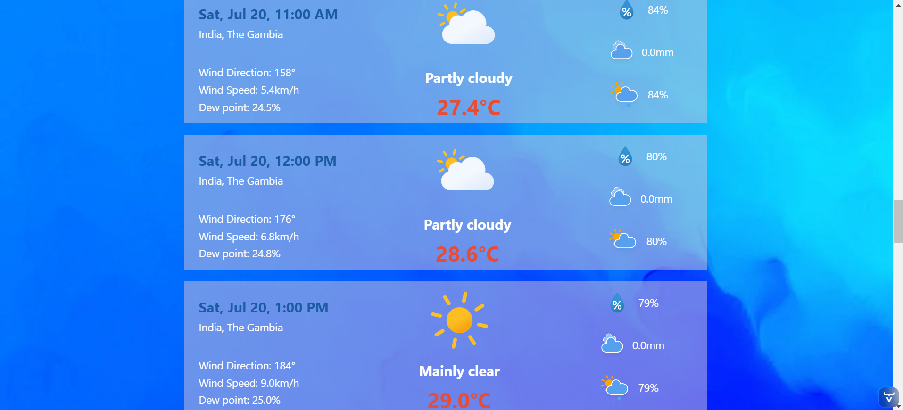

# Weather App

## Overview

The Weather App is a web application that allows users to log in, search for weather information by city name, and view detailed weather data. Users can see current weather conditions, hourly rain information for the current day, and a 7-day weather forecast. Additionally, users can select a specific day to view hourly weather information for that day.

## Technologies Used

- **Java 17**
- **Vaadin 24.4.5**
- **CDI (Contexts and Dependency Injection) 15.0**
- **Jakarta EE 10**
- **MySQL**
- **JWT (JSON Web Token)**
- **WildFly / TomEE** (Application Servers)
- **Maven** (Build Tool)

## Project Structure

The project is structured as a typical Maven project with the following main directories:

- `src/main/java`: Contains the Java source code.
- `src/main/resources`: Contains the resource files.
- `src/main/webapp`: Contains the web application files.

## Features

1. **User Authentication**: Users must log in to access the application.
2. **City Search**: Users can search for cities by name to get weather information.
3. **Weather Information**:
   - Current weather conditions.
   - Hourly rain information for the current day.
   - 7-day weather forecast starting from the current day.
4. **Detailed Day View**: Users can select a specific day to view hourly weather information for that day.
5. **Favourite List**: Users can mark cities as favourites and view them in a favourite list.

## Getting Started

### Prerequisites

- **Java 11 or higher**
- **Maven**
- **MySQL**
- **An application server (WildFly or TomEE recommended)**
- **Docker**
- **Docker Compose**

### Installation

1. **Clone the repository**:
    ```sh
    git clone git@github.com:faizul-nayan/WeatherApp.git
    cd WeatherApp
    ```

2. **Configure the Database**:
   - Set up a MySQL database.
   - Update the database connection settings in the application properties file.

3. **Build the Project**:
    ```sh
    mvn clean install
    ```

4. **Deploy to Application Server**:
   - For **WildFly**:
     ```sh
     mvn wildfly:run
     ```

### Running the Application

After deploying the application, you can access it in your web browser at `http://localhost:8080/weather-app/login`.

### Usage

1. **Log In**:
   - Enter your credentials on the login page.
     
2. **Search for a City**:
   - Use the search bar to enter the name of a city.
     
3. **View All Cities**:
   - Show all cities across the world.
   - Select a city from the search results.
   - Data can be filtered based on location using the filter bar.
   - City can be marked as favourite.

4. **Favourite List**:
   - Display the favourite list.
    
5. **View Weather Information**:
   - **Current Weather**: Displays the current weather conditions.
     
   - **Hourly Rain Information**: Shows rain information for the current day, updated hourly.
   - **7-Day Forecast**: Provides weather information for the next 7 days.
   - 
   - **Detailed Day View**: Select a day from the 7-day forecast to view detailed hourly weather information.
     
   

## Dependencies

The project relies on several key dependencies defined in the `pom.xml` file:

- **Vaadin**: For building the web UI.
- **Jakarta EE Web API**: For using Jakarta EE features.
- **Vaadin CDI**: For integrating Vaadin with CDI.
- **SLF4J Simple**: For logging.
- **Vaadin Charts**: For including charts in the UI.
- **Vaadin Testbench**: For testing the Vaadin application.
- **JJWT**: For handling JSON Web Tokens.
- **MySQL Connector**: For database connectivity.
- **WebDriverManager**: For managing WebDriver binaries in tests.

## Makefile

The Makefile provides a set of commands to build, deploy, and manage the application using Docker.

### Usage

- **Build the project**: 
```sh
     make build
```
- **Deploy the project to Docker containers**:
```sh
     make deploy
```
- **Stop and remove Docker containers**:
```sh
     make stop
```
- **Clean the build artifacts**:
```sh
     make clean
```
- **Clean and rebuild the project, then deploy**:
```sh
     make rebuild
```
- **Show the status of Docker containers**:
```sh
     make status
```
- **Display logs from Docker containers**:
```sh
     make logs
```

## Docker Compose

The Docker Compose file defines the services required to run the application, including the MySQL database and WildFly application server.

### Docker Compose Usage

- **Start the services**:
```sh
     docker-compose up -d
```
- **Stop the services**:
```sh
     docker-compose down
```
- **View the status of services**:
```sh
     docker-compose ps
```
- **View the logs of services**:
```sh
     docker-compose logs -f
```

## Install by shell

setup.sh file allow you run the project in your environment(linux) easily without any difficulties

### Shell usage

- **Permission**
```sh
     chmod +x setup.sh
```
- **To run the shell script**
```sh
     ./setup.sh
```

## Need to focus
you may need you configure database in jboss server manually if needed. for this please consider my following configurations or modify the configurations as per your configurations
```sh
     <persistence-unit name="my-unit" transaction-type="JTA">
        <jta-data-source>java:/MySqlDS</jta-data-source>
        <properties>
            <property name="jakarta.persistence.jdbc.driver" value="com.mysql.cj.jdbc.Driver"/>
            <property name="jakarta.persistence.jdbc.url" value="jdbc:mysql://localhost:3306/weather-app"/>
            <property name="jakarta.persistence.jdbc.user" value="root"/>
            <property name="jakarta.persistence.jdbc.password" value=""/>
            <property name="hibernate.dialect" value="org.hibernate.dialect.MySQL8Dialect"/>
        </properties>
     </persistence-unit>
```

please find the database dump file in project directory with name

##### dump-weather-app .sql

Thank you for your time! Feel free to ask me for any queries!